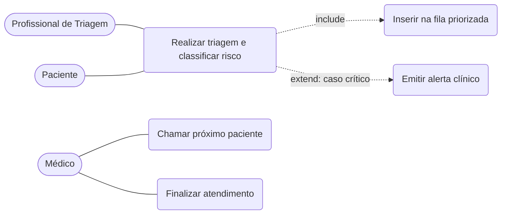

# Diagramas e Guia de Implementação do Gestar

Modelagem da fatia implementada: **triagem com classificação de risco + fila priorizada**.
As descrições textuais dos casos de uso estão em `requisitos.md` (Seção 7); aqui ficam
os diagramas e o guia que orienta a codificação.

---

## 1. Diagrama de Casos de Uso



---

## 2. Diagrama de Classes

```mermaid
classDiagram
    class Paciente {
        -String id
        -String nome
        -LocalDate dataNascimento
        +getNome() String
    }
    class SinaisVitais {
        -int frequenciaCardiaca
        -double temperatura
        -int saturacao
        -int escalaDor
    }
    class NivelUrgencia {
        <<enumeration>>
        VERMELHO
        LARANJA
        AMARELO
        VERDE
        -int prioridade
        -int tempoAlvoMinutos
        +getPrioridade() int
    }
    class CategoriaPrioridade {
        <<enumeration>>
        PRIORIDADE_MAXIMA
        PREFERENCIAL
        NORMAL
        -int peso
    }
    class StatusAtendimento {
        <<enumeration>>
        AGUARDANDO_TRIAGEM
        EM_TRIAGEM
        NA_FILA
        EM_ATENDIMENTO
        FINALIZADO
        ENCAMINHADO
    }
    class ProtocolType {
        <<enumeration>>
        MANCHESTER
        SIMPLE
    }
    class Atendimento {
        -String id
        -Paciente paciente
        -SinaisVitais sinaisVitais
        -String queixaPrincipal
        -NivelUrgencia nivel
        -CategoriaPrioridade categoriaPrioridade
        -StatusAtendimento status
        -LocalDateTime dataHoraChegada
        +avancarStatus(StatusAtendimento) void
        +reclassificar(NivelUrgencia) void
        +ehCritico() boolean
    }
    class ClassificationStrategy {
        <<interface>>
        +classify(MedicalCare) UrgencyLevel
    }
    class ManchesterClassification {
        +classify(MedicalCare) UrgencyLevel
    }
    class SimpleClassification {
        +classify(MedicalCare) UrgencyLevel
    }
    class ClassificationStrategyFactory {
        +create(ProtocolType) ClassificationStrategy$
    }
    class MedicalCareRepositoryContract {
        <<interface>>
        +save(MedicalCare) void
        +findById(String) MedicalCare
        +findAll() List~MedicalCare~
    }
    class QueueManager {
        -PriorityQueue~MedicalCare~ queue
        +add(MedicalCare) void
        +next() MedicalCare
        +size() int
    }
    class AlertObserver {
        <<interface>>
        +notify(MedicalCare) void
    }
    class MedicalPanel {
        +notify(MedicalCare) void
    }
    class ClinicalNotifier {
        -List~AlertObserver~ observers
        +register(AlertObserver) void
        +triggerAlert(MedicalCare) void
    }
    class MedicalCareService {
        -ClassificationStrategy strategy
        -MedicalCareRepositoryContract repository
        -PatientRepositoryContract patientRepository
        -QueueManager queue
        -ClinicalNotifier notifier
        +create(MedicalCareRequest) MedicalCareResponse
        +refer(MedicalCareRequest) MedicalCareResponse
        +update(String, MedicalCareRequest) MedicalCareResponse
        +callNext() Optional~MedicalCareResponse~
        +queueStatus() QueueStatus
    }

    MedicalCare --> Patient
    MedicalCare --> UrgencyLevel
    MedicalCare --> PriorityCategory
    MedicalCare --> MedicalCareStatus
    MedicalCare *-- VitalSigns
    ManchesterClassification ..|> ClassificationStrategy
    SimpleClassification ..|> ClassificationStrategy
    ClassificationStrategyFactory ..> ClassificationStrategy
    ClassificationStrategyFactory ..> ProtocolType
    MedicalPanel ..|> AlertObserver
    ClinicalNotifier o-- AlertObserver
    MedicalCareService --> ClassificationStrategy
    MedicalCareService --> MedicalCareRepositoryContract
    MedicalCareService --> PatientRepositoryContract
    MedicalCareService --> QueueManager
    MedicalCareService --> ClinicalNotifier
```



---

## 3. Guia de Implementação

| Classe | Responsabilidade | Padrão / SOLID |
|--------|------------------|----------------|
| `Patient`, `VitalSigns` | Dados do paciente e da aferição | Entidade / Value Object (SRP) |
| `MedicalCare` | Representa um atendimento e seu estado | Entidade (SRP) |
| `UrgencyLevel` | Níveis de risco com prioridade e tempo-alvo | Enum |
| `MedicalCareStatus` | Estados do ciclo de vida do atendimento | Enum |
| `ClassificationStrategy` | Contrato para classificar o risco | **Strategy** (OCP, LSP, ISP) |
| `ManchesterClassification` / `SimpleClassification` | Regras concretas de classificação | **Strategy** |
| `ClassificationStrategyFactory` | Cria a estratégia de acordo com o protocolo | **Factory Method** (criacional) |
| `MedicalCareRepositoryContract` | Contrato de persistência | **Repository** (DIP) |
| `PostgresMedicalCareRepository` | Persistência em banco | **Repository** |
| `QueueManager` | Ordena por prioridade e, em caso de empate, por chegada | Lógica testável |
| `AlertObserver` / `MedicalPanel` | Reagem a casos críticos | **Observer** (comportamental) |
| `ClinicalNotifier` | Dispara alertas aos observadores | **Observer** (Subject) |
| `MedicalCareService` | Orquestra triagem, fila, alerta e persistência | Depende de interfaces (DIP, SRP) |
| `ApiServer`, `MedicalCareController` | Camada de interface: expõe as rotas e fala com o `MedicalCareService` | Front Controller (SRP, DIP) |
| `MedicalCareRequest`, `MedicalCareResponse`, `QueueResponse` | Converte entrada/saída da API e valida o formato da entrada | DTO (SRP) |

**Coração testável:** `QueueManager`. Use `PriorityQueue` com um `Comparator` que
ordena **(1)** por `UrgencyLevel.prioridade` (Vermelho mais urgente), **(2)** por
`CategoriaPrioridade` (idoso 80+ > PCD/idoso 60+ > normal) e **(3)** por
`dataHoraChegada` (mais antigo primeiro). A unidade usa 4 cores (sem Azul).

## 4. Estrutura de pacotes sugerida (Maven)

```
src/main/java/br/unibh/gestar/
├── domain/         Patient, MedicalCare, VitalSigns, PriorityCategory, MedicalCareStatus, UrgencyLevel
├── classification/ ClassificationStrategy, ManchesterClassification, SimpleClassification,
│                   ProtocolType, ClassificationStrategyFactory
├── queue/          QueueManager, QueueUtils
├── contract/       MedicalCareRepositoryContract, PatientRepositoryContract
├── infra/          PostgresConnection, PostgresMedicalCareRepository, PostgresPatientRepository
├── alert/          AlertObserver, MedicalPanel, ClinicalNotifier
├── service/        MedicalCareService, PatientService, QueueStatus
├── entrypoint/     ApiServer, controller/, dto/, routes/
└── Main.java       bootstrap: monta as dependências e sobe a API
src/test/java/br/unibh/gestar/
├── queue/          QueueManagerTest
├── classification/ ManchesterClassificationTest, SimpleClassificationTest
├── service/        MedicalCareServiceTest, PatientServiceTest
└── alert/          ClinicalNotifierTest
```

## 5. Mapa dos padrões (para a documentação e a defesa)

| Categoria | Padrão | Onde | Justificativa |
|-----------|--------|------|---------------|
| Criacional | Factory Method | `ClassificationStrategyFactory` | Cria a estratégia certa sem acoplar o serviço às classes concretas |
| Estrutural | Repository | `MedicalCareRepositoryContract` | Isola a persistência; permite trocar memória por banco sem afetar a regra |
| Comportamental | Strategy | `ClassificationStrategy` | Troca o protocolo de classificação sem reescrever a fila |
| Comportamental | Observer | `ClinicalNotifier` / `AlertObserver` | Notifica o corpo clínico em casos críticos |

> **Evolução futura:** mantivemos `StatusAtendimento` como enum por simplicidade. O ciclo
> de vida do atendimento poderia ser refatorado para o padrão **State** (GoF) numa próxima
> iteração. Não é necessário neste escopo, já que os quatro padrões adotados cobrem as
> categorias criacional, estrutural e comportamental.
