# Diagramas e Guia de Implementação — Gestar

Modelagem da fatia implementada: **triagem com classificação de risco + fila priorizada**.
As descrições textuais dos casos de uso estão em `requisitos.md` (Seção 7); aqui ficam
os diagramas e o guia que orienta a codificação.

---

## 1. Diagrama de Casos de Uso


---

## 2. Diagrama de Classes

```mermaid
classDiagram
    class Paciente {
        -String id
        -String nome
        -LocalDate dataNascimento
        +getNome() String
    }
    class SinaisVitais {
        -int frequenciaCardiaca
        -double temperatura
        -int saturacao
        -int escalaDor
    }
    class NivelUrgencia {
        <<enumeration>>
        VERMELHO
        LARANJA
        AMARELO
        VERDE
        -int prioridade
        -int tempoAlvoMinutos
        +getPrioridade() int
    }
    class CategoriaPrioridade {
        <<enumeration>>
        PRIORIDADE_MAXIMA
        PREFERENCIAL
        NORMAL
        -int peso
    }
    class StatusAtendimento {
        <<enumeration>>
        AGUARDANDO_TRIAGEM
        EM_TRIAGEM
        NA_FILA
        EM_ATENDIMENTO
        FINALIZADO
        ENCAMINHADO
    }
    class TipoProtocolo {
        <<enumeration>>
        MANCHESTER
        SIMPLES
    }
    class Atendimento {
        -String id
        -Paciente paciente
        -SinaisVitais sinaisVitais
        -String queixaPrincipal
        -NivelUrgencia nivel
        -CategoriaPrioridade categoriaPrioridade
        -StatusAtendimento status
        -LocalDateTime dataHoraChegada
        +avancarStatus(StatusAtendimento) void
        +reclassificar(NivelUrgencia) void
        +ehCritico() boolean
    }
    class EstrategiaClassificacao {
        <<interface>>
        +classificar(Atendimento) NivelUrgencia
    }
    class ClassificacaoManchester {
        +classificar(Atendimento) NivelUrgencia
    }
    class ClassificacaoSimples {
        +classificar(Atendimento) NivelUrgencia
    }
    class FabricaEstrategiaClassificacao {
        +criar(TipoProtocolo) EstrategiaClassificacao$
    }
    class AtendimentoRepository {
        <<interface>>
        +salvar(Atendimento) void
        +buscarPorId(String) Atendimento
        +listarTodos() List~Atendimento~
    }
    class AtendimentoRepositoryEmMemoria {
        -Map~String, Atendimento~ dados
        +salvar(Atendimento) void
        +buscarPorId(String) Atendimento
        +listarTodos() List~Atendimento~
    }
    class GerenciadorFila {
        -PriorityQueue~Atendimento~ fila
        +adicionar(Atendimento) void
        +proximo() Atendimento
        +tamanho() int
    }
    class ObservadorAlerta {
        <<interface>>
        +notificar(Atendimento) void
    }
    class PainelMedico {
        +notificar(Atendimento) void
    }
    class NotificadorClinico {
        -List~ObservadorAlerta~ observadores
        +registrar(ObservadorAlerta) void
        +dispararAlerta(Atendimento) void
    }
    class ServicoTriagem {
        -EstrategiaClassificacao estrategia
        -AtendimentoRepository repositorio
        -GerenciadorFila fila
        -NotificadorClinico notificador
        +realizarTriagem(Paciente, SinaisVitais, String) Atendimento
        +encaminhar(Atendimento, String, String) void
        +reclassificar(Atendimento, SinaisVitais) Atendimento
        +chamarProximo() Atendimento
        +finalizar(Atendimento) void
    }

    Atendimento --> Paciente
    Atendimento --> NivelUrgencia
    Atendimento --> CategoriaPrioridade
    Atendimento --> StatusAtendimento
    Atendimento *-- SinaisVitais
    ClassificacaoManchester ..|> EstrategiaClassificacao
    ClassificacaoSimples ..|> EstrategiaClassificacao
    FabricaEstrategiaClassificacao ..> EstrategiaClassificacao
    FabricaEstrategiaClassificacao ..> TipoProtocolo
    AtendimentoRepositoryEmMemoria ..|> AtendimentoRepository
    PainelMedico ..|> ObservadorAlerta
    NotificadorClinico o-- ObservadorAlerta
    ServicoTriagem --> EstrategiaClassificacao
    ServicoTriagem --> AtendimentoRepository
    ServicoTriagem --> GerenciadorFila
    ServicoTriagem --> NotificadorClinico
```



---

## 3. Guia de Implementação (norte para codar)

| Classe | Responsabilidade | Padrão / SOLID |
|--------|------------------|----------------|
| `Paciente`, `SinaisVitais` | Dados do paciente e da aferição | Entidade / Value Object (SRP) |
| `Atendimento` | Representa um atendimento e seu estado | Entidade (SRP) |
| `NivelUrgencia` | Níveis de risco com prioridade e tempo-alvo | Enum |
| `StatusAtendimento` | Estados do ciclo de vida do atendimento | Enum |
| `EstrategiaClassificacao` | Contrato para classificar risco | **Strategy** (OCP, LSP, ISP) |
| `ClassificacaoManchester` / `ClassificacaoSimples` | Regras concretas de classificação | **Strategy** |
| `FabricaEstrategiaClassificacao` | Cria a estratégia conforme o protocolo | **Factory Method** (criacional) |
| `AtendimentoRepository` | Contrato de persistência | **Repository** (DIP) |
| `AtendimentoRepositoryEmMemoria` | Persistência em memória (sem banco) | **Repository** |
| `GerenciadorFila` | Ordena por prioridade e, no empate, por chegada | Lógica central testável |
| `ObservadorAlerta` / `PainelMedico` | Reagem a casos críticos | **Observer** (comportamental) |
| `NotificadorClinico` | Dispara alertas aos observadores | **Observer** (Subject) |
| `ServicoTriagem` | Orquestra triagem → fila → alerta | Depende de interfaces (DIP, SRP) |

**Coração testável:** `GerenciadorFila`. Use `PriorityQueue` com um `Comparator` que
ordena **(1)** por `NivelUrgencia.prioridade` (Vermelho mais urgente), **(2)** por
`CategoriaPrioridade` (idoso 80+ > PCD/idoso 60+ > normal) e **(3)** por
`dataHoraChegada` (mais antigo primeiro). A unidade usa 4 cores (sem Azul).

## 4. Estrutura de pacotes sugerida (Maven)

```
src/main/java/br/unibh/gestar/
├── dominio/        Paciente, Atendimento, SinaisVitais, NivelUrgencia, StatusAtendimento
├── classificacao/  EstrategiaClassificacao, ClassificacaoManchester, ClassificacaoSimples,
│                   TipoProtocolo, FabricaEstrategiaClassificacao
├── fila/           GerenciadorFila
├── repositorio/    AtendimentoRepository, AtendimentoRepositoryEmMemoria
├── alerta/         ObservadorAlerta, PainelMedico, NotificadorClinico
├── servico/        ServicoTriagem
└── Main.java       (demonstração do fluxo)
src/test/java/br/unibh/gestar/
├── fila/           GerenciadorFilaTest
├── classificacao/  ClassificacaoManchesterTest
└── servico/        ServicoTriagemTest
```

## 5. Mapa dos padrões (para a documentação e a defesa)

| Categoria | Padrão | Onde | Justificativa |
|-----------|--------|------|---------------|
| Criacional | Factory Method | `FabricaEstrategiaClassificacao` | Cria a estratégia certa sem acoplar o serviço às classes concretas |
| Estrutural | Repository | `AtendimentoRepository` | Isola a persistência; permite trocar memória por banco sem afetar a regra |
| Comportamental | Strategy | `EstrategiaClassificacao` | Troca o protocolo de classificação sem reescrever a fila |
| Comportamental | Observer | `NotificadorClinico` / `ObservadorAlerta` | Notifica o corpo clínico em casos críticos |

> **Evolução opcional:** `StatusAtendimento` está como enum por simplicidade. Se quiserem
> exibir um padrão a mais, dá para refatorar o ciclo de vida do atendimento para o padrão
> **State** (GoF) — mas não é necessário, os quatro acima já cobrem criacional, estrutural
> e comportamental.
