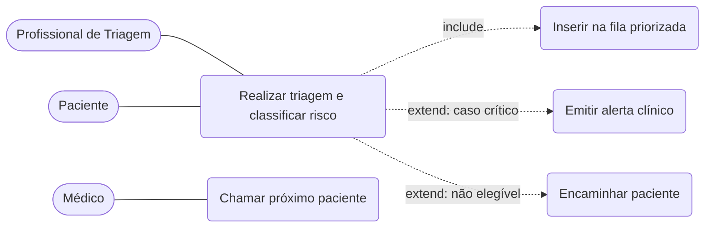

# Diagramas e Guia de Implementação do Gestar

Modelagem da fatia implementada: triagem com classificação de risco, fila priorizada,
alertas, persistência em PostgreSQL e exposição por API REST. As descrições textuais dos
casos de uso estão em `requisitos.md` (Seção 8); aqui ficam os diagramas e o guia. Os
identificadores seguem o código (em inglês).

---

## 1. Diagrama de Casos de Uso



---

## 2. Diagrama de Classes

```mermaid
classDiagram
    class Patient {
        -String id
        -String name
        -LocalDate birthDate
        +getAge() int
    }
    class VitalSigns {
        -int systolicPressure
        -int diastolicPressure
        -int heartRate
        -int respiratoryRate
        -double temperature
        -int oxygenSaturation
        -int painScale
    }
    class UrgencyLevel {
        <<enumeration>>
        RED
        ORANGE
        YELLOW
        GREEN
        -int priority
        -int targetTimeMinutes
        +getPriority() int
    }
    class PriorityCategory {
        <<enumeration>>
        HIGHEST_PRIORITY
        PREFERRED
        NORMAL
        -int weight
        +forAge(int) PriorityCategory$
    }
    class MedicalCareStatus {
        <<enumeration>>
        WAITING_FOR_TRIAGE
        IN_TRIAGE
        IN_QUEUE
        IN_MEDICAL_CARE
        FINISHED
        REFERRED
    }
    class ProtocolType {
        <<enumeration>>
        MANCHESTER
        SIMPLE
    }
    class MedicalCare {
        -String id
        -Patient patient
        -VitalSigns vitalSigns
        -String mainComplaint
        -UrgencyLevel urgencyLevel
        -PriorityCategory priorityCategory
        -MedicalCareStatus status
        -LocalDateTime arrivalDateTime
        +setClassification(UrgencyLevel) void
        +reclassify(UrgencyLevel) void
        +markReferred(String, String) void
        +advanceStatus(MedicalCareStatus) void
        +isCritical() boolean
    }
    class ClassificationStrategy {
        <<interface>>
        +classify(MedicalCare) UrgencyLevel
    }
    class ManchesterClassification {
        +classify(MedicalCare) UrgencyLevel
    }
    class SimpleClassification {
        +classify(MedicalCare) UrgencyLevel
    }
    class ClassificationStrategyFactory {
        +create(ProtocolType) ClassificationStrategy$
    }
    class MedicalCareRepositoryContract {
        <<interface>>
        +save(MedicalCare) void
        +findById(String) Optional~MedicalCare~
        +listAll() List~MedicalCare~
    }
    class PatientRepositoryContract {
        <<interface>>
        +save(Patient) void
        +update(Patient) void
        +findByNameAndBirthDate(String, LocalDate) Optional~Patient~
        +listAll() List~Patient~
    }
    class PostgresMedicalCareRepository {
        +save(MedicalCare) void
        +findById(String) Optional~MedicalCare~
        +listAll() List~MedicalCare~
    }
    class PostgresPatientRepository {
        +save(Patient) void
        +listAll() List~Patient~
    }
    class QueueManager {
        -PriorityQueue~MedicalCare~ queue
        +add(MedicalCare) void
        +next() MedicalCare
        +peek() MedicalCare
        +size() int
        +isEmpty() boolean
    }
    class AlertObserver {
        <<interface>>
        +notify(MedicalCare) void
    }
    class MedicalPanel {
        +notify(MedicalCare) void
    }
    class ClinicalNotifier {
        -List~AlertObserver~ observers
        +register(AlertObserver) void
        +triggerAlert(MedicalCare) void
    }
    class MedicalCareService {
        -ClassificationStrategy strategy
        -MedicalCareRepositoryContract repository
        -PatientRepositoryContract patientRepository
        -QueueManager queue
        -ClinicalNotifier notifier
        +create(MedicalCareRequest) MedicalCareResponse
        +refer(MedicalCareRequest) MedicalCareResponse
        +reclassify(String, VitalSigns) MedicalCareResponse
        +callNext() Optional~MedicalCareResponse~
        +finish(String) MedicalCareResponse
        +queueStatus() QueueStatus
    }
    class PatientService {
        -PatientRepositoryContract repository
        +create(PatientRequest) PatientResponse
        +list() List~PatientResponse~
    }
    class ApiServer {
        +start(int) Javalin
    }
    class MedicalCareController {
        +register(Javalin) void
    }

    MedicalCare --> Patient
    MedicalCare --> VitalSigns
    MedicalCare --> UrgencyLevel
    MedicalCare --> PriorityCategory
    MedicalCare --> MedicalCareStatus
    ManchesterClassification ..|> ClassificationStrategy
    SimpleClassification ..|> ClassificationStrategy
    ClassificationStrategyFactory ..> ClassificationStrategy
    PostgresMedicalCareRepository ..|> MedicalCareRepositoryContract
    PostgresPatientRepository ..|> PatientRepositoryContract
    MedicalPanel ..|> AlertObserver
    ClinicalNotifier o-- AlertObserver
    MedicalCareService --> ClassificationStrategy
    MedicalCareService --> MedicalCareRepositoryContract
    MedicalCareService --> PatientRepositoryContract
    MedicalCareService --> QueueManager
    MedicalCareService --> ClinicalNotifier
    ApiServer --> MedicalCareController
    MedicalCareController --> MedicalCareService
```



---

## 3. Guia de Implementação

| Classe | Responsabilidade | Padrão / SOLID |
|--------|------------------|----------------|
| `Patient`, `VitalSigns` | Dados do paciente e da aferição | Entidade / Value Object (SRP) |
| `MedicalCare` | Representa um atendimento e seu estado | Entidade (SRP) |
| `UrgencyLevel`, `PriorityCategory`, `MedicalCareStatus` | Níveis, categorias e estados | Enums |
| `ClassificationStrategy` | Contrato para classificar risco | **Strategy** (OCP, LSP, ISP) |
| `ManchesterClassification` / `SimpleClassification` | Regras concretas de classificação | **Strategy** |
| `ClassificationStrategyFactory` | Cria a estratégia conforme o protocolo | **Factory Method** (criacional) |
| `MedicalCareRepositoryContract` / `PatientRepositoryContract` | Contratos de persistência | **Repository** (DIP) |
| `PostgresMedicalCareRepository` / `PostgresPatientRepository` | Persistência em PostgreSQL | **Repository** |
| `QueueManager` | Ordena por cor, categoria e chegada | Lógica central testável |
| `AlertObserver` / `MedicalPanel` | Reagem a casos críticos | **Observer** (comportamental) |
| `ClinicalNotifier` | Dispara alertas aos observadores | **Observer** (Subject) |
| `MedicalCareService` / `PatientService` | Orquestram o fluxo | Dependem de interfaces (DIP, SRP) |
| `ApiServer` / `MedicalCareController` | Expõem o fluxo por HTTP | Camada de entrada (API REST) |

**Coração testável:** `QueueManager`. Usa `PriorityQueue` com um `Comparator` que
ordena (1) por `UrgencyLevel.priority` (RED mais urgente), (2) por `PriorityCategory`
(idoso 80+ > PCD/idoso 60+ > normal) e (3) por `arrivalDateTime` (mais antigo primeiro).
A unidade usa 4 cores (sem Azul).

## 4. Estrutura de pacotes

```
src/main/java/br/unibh/gestar/
├── domain/          MedicalCare, Patient, VitalSigns, UrgencyLevel,
│                    MedicalCareStatus, PriorityCategory
├── classification/  ClassificationStrategy, ManchesterClassification,
│                    SimpleClassification, ProtocolType, ClassificationStrategyFactory
├── queue/           QueueManager, QueueUtils
├── contract/        MedicalCareRepositoryContract, PatientRepositoryContract
├── infra/           PostgresConnection, PostgresMedicalCareRepository,
│                    PostgresPatientRepository
├── alert/           AlertObserver, MedicalPanel, ClinicalNotifier
├── service/         MedicalCareService, PatientService, QueueStatus
├── entrypoint/      ApiServer, controller/(MedicalCareController, PatientController),
│                    routes/, dto/
└── Main.java        (sobe a API)
db/schema.sql        (esquema do PostgreSQL)
```

## 5. Mapa dos padrões

| Categoria | Padrão | Onde | Justificativa |
|-----------|--------|------|---------------|
| Criacional | Factory Method | `ClassificationStrategyFactory` | Cria a estratégia certa sem acoplar o serviço às classes concretas |
| Estrutural | Repository | `MedicalCareRepositoryContract` + `PostgresMedicalCareRepository` | Isola a persistência; permitiu adotar PostgreSQL sem afetar a regra |
| Comportamental | Strategy | `ClassificationStrategy` | Troca o protocolo de classificação sem reescrever a fila |
| Comportamental | Observer | `ClinicalNotifier` / `AlertObserver` | Notifica o corpo clínico em casos críticos |

> **Arquitetura:** a persistência usa PostgreSQL (`PostgresMedicalCareRepository`, com o
> esquema em `db/schema.sql`) atrás do contrato `MedicalCareRepositoryContract` (DIP), e a
> fila de prioridade vive em memória (`QueueManager`). A camada `entrypoint` expõe o fluxo
> por uma API REST (Javalin); os endpoints estão documentados no README. O ciclo de vida do
> atendimento (`MedicalCareStatus`) é um enum e poderia evoluir para o padrão State numa
> próxima iteração, mas os quatro padrões adotados já cobrem as categorias criacional,
> estrutural e comportamental.
